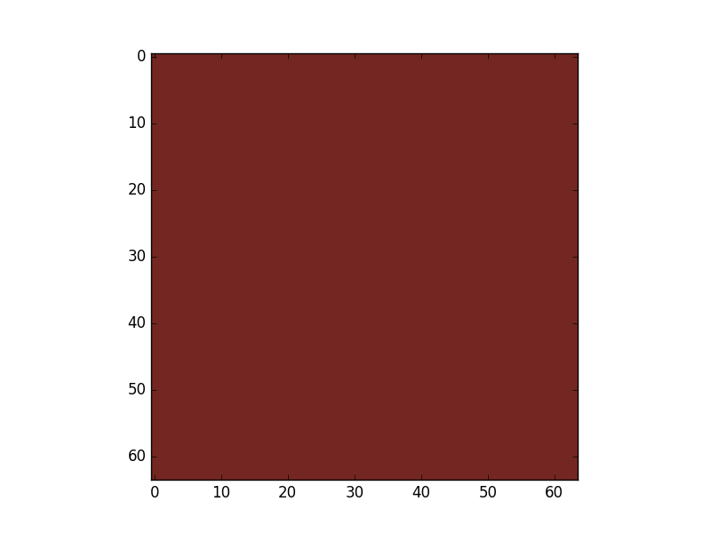
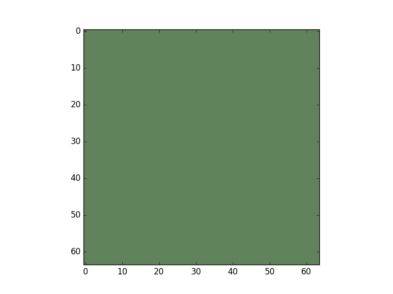
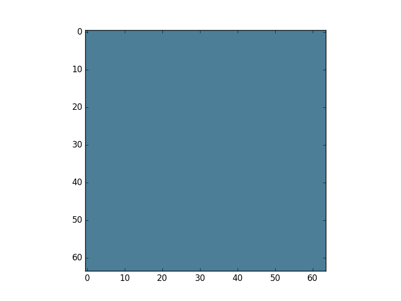
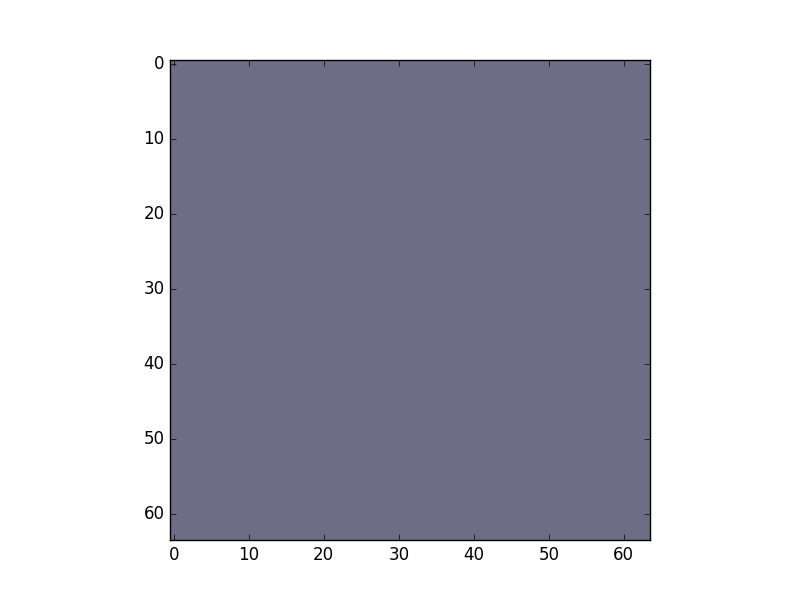
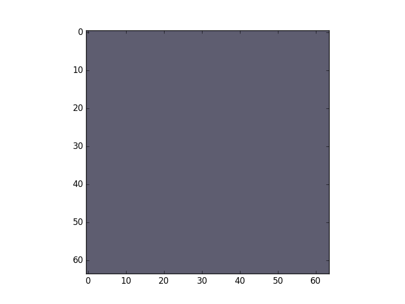
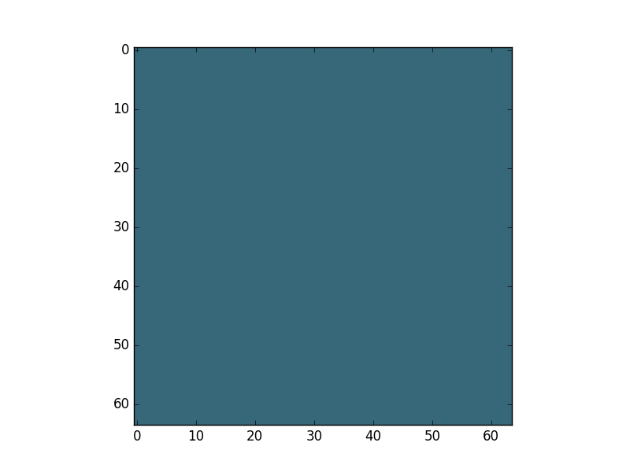
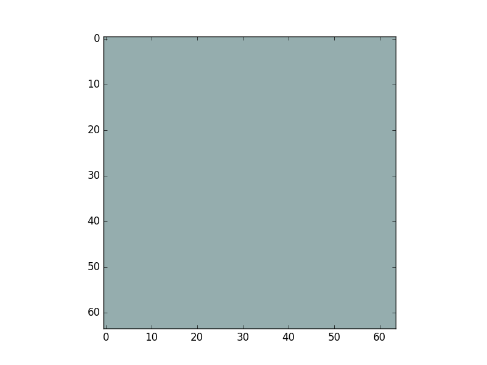
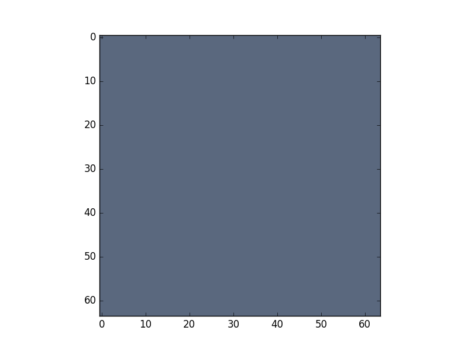
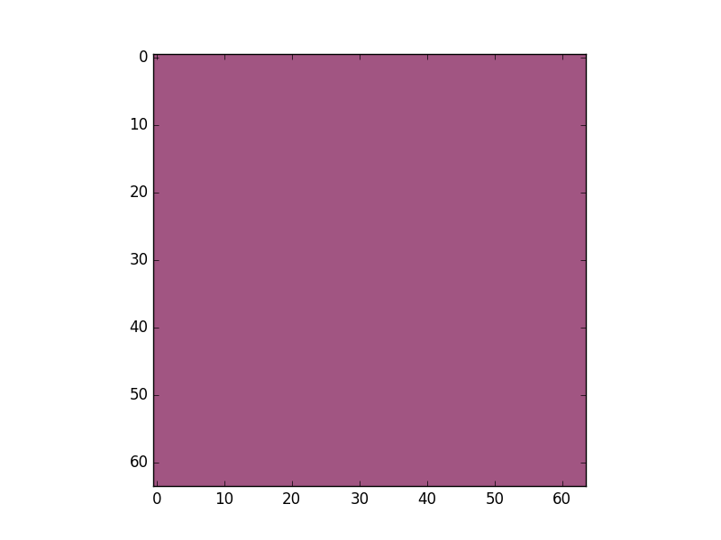
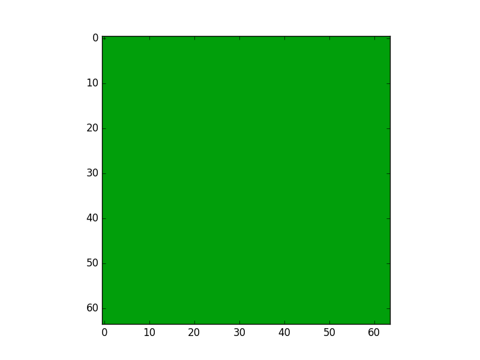

# Learning To Name Colors With Word Embeddings
On a recent trip to Michigan, my friend [Tim Sosa](https://twitter.com/TimDrawsFish) brought up a [blog post he read](http://lewisandquark.tumblr.com/post/160776374467/new-paint-colors-invented-by-neural-network) ([Atlantic article](https://www.theatlantic.com/technology/archive/2017/05/when-a-robot-names-a-new-color-of-paint/527421/)) where the author describes how she built a neural network that generates color names from RGB values. I thought the idea was really neat, but I found the results pretty underwhelming. A lot of the color names were nonsensical (i.e., not actual words), and the pairings between the generated names and the colors seemed pretty random, so it wasn't clear whether the model was actually learning a meaningful function to map colors to language. I wondered if the idea could be improved upon, so I went ahead and built my own model to play around with.

The first thing I noticed about the color data (which I downloaded from [here](https://www.sherwin-williams.com/property-facility-managers/color/tools/downloadable-color-palettes)) was that there were only about 1,500 named colors, so there's a discrepancy between the data Janelle was using and what I found (this is an example of why open science is important when doing non-trivial things!). My suspicion is that the model was mostly trying to learn a character-level language model from the data, so regardless of whether there are 1,500 named colors or 7,700, that's definitely not enough words and phrases to learn anything meaningful about the English language. With that in mind, I decided to build a model that mapped colors to names (and vice-versa) using pre-trained word embeddings (I used the ```word2vec``` embeddings found [here](https://drive.google.com/file/d/0B7XkCwpI5KDYNlNUTTlSS21pQmM/edit?usp=sharing)). The advantage of using pre-trained word embeddings is that the model doesn't have to learn as much about language during training, it just needs to learn how different nouns and colors map to the RGB space and how adjectives should modify colors (e.g., in the case of "Analytical Gray").

Using these word embeddings, I built two different models: one that maps a name to a color, and one that maps a color to a name. The model that learned to map names to colors is a straightforward convolutional neural network, and it seems to work pretty well. Examples of what the model considers "red", "green", "blue", and "purple" can be seen below.

   

But the model also knows more interesting colors than those. For example, it knows that "deep purple" is a darker version of purple.

 

It also knows that "ocean" is an aqua color, and that "calm ocean" is a lighter aqua while "stormy ocean" is a gray purple.

  

The model that learned to map colors to names is a recurrent neural network that takes RGB values as input and attempts to predict the word embeddings as output. I decided that rather than generate single color names, it would be more interesting/useful to generate candidate words that could then be used to come up with a color name. For example, when providing RGB values of 161, 85, and 130 (a fuchsia-like color) as input to the model, it generates the following:



Word #&#xfeff;1 candidates:
```
roses_hydrangeas
lacy_foliage
tussie
sweetly_fragrant
coppery_pink
grevillea
oriental_poppies
maidenhair_ferns
oak_leaf_hydrangea
blue_hydrangeas
```

Word #&#xfeff;2 candidates:
```
violet
lavender_flowers
wonderfully_fragrant
fuchsia
anise_hyssop
monarda
purple
purple_blooms
cornflowers
hibiscuses
```

Word #&#xfeff;3 candidates:
```
purple
pink
violet
fuchsia
roses
purple_blooms
lavender_flowers
lavender
Asiatic_lilies
monarda
```

Word #&#xfeff;4 candidates:
```
roses
purple
pink
red
violet
fuchsia
violets
Asiatic_lilies
purple_blooms
flowers
```

I personally like "sweetly fragrant fuchsia"

Similarly, when providing RGB values of 1, 159, and 11 (a booger-green color) as input to the model, it generates the following:



Word #&#xfeff;1 candidates:
```
greenbelt
drainage_easements
annexations
Controller_Bud_Polhill
Annexations
Buttertubs_Marsh
sprigging
easements
buffer_strips
Growth_Boundary
```

Word #&#xfeff;2 candidates:
```
green
jade
blues_pinks
purples_blues
greeny
sienna
plumbago
sage_Salvia
olive
purple_leaved
```

Word #&#xfeff;3 candidates:
```
green
plumbago
purples_blues
allamanda
greeny
purple_leaved
lime
hibiscuses
sage_Salvia
blues_pinks
```

Word #&#xfeff;4 candidates:
```
green
pineapple_sage
plumbago
purple_leaved
allamanda
hibiscuses
lime
snowberry
sage_Salvia
purples_blues
```

I personally like "sprigging green". Anyway, it seems like the word embeddings do allow the model to learn some pretty interesting relationships between colors and language.
